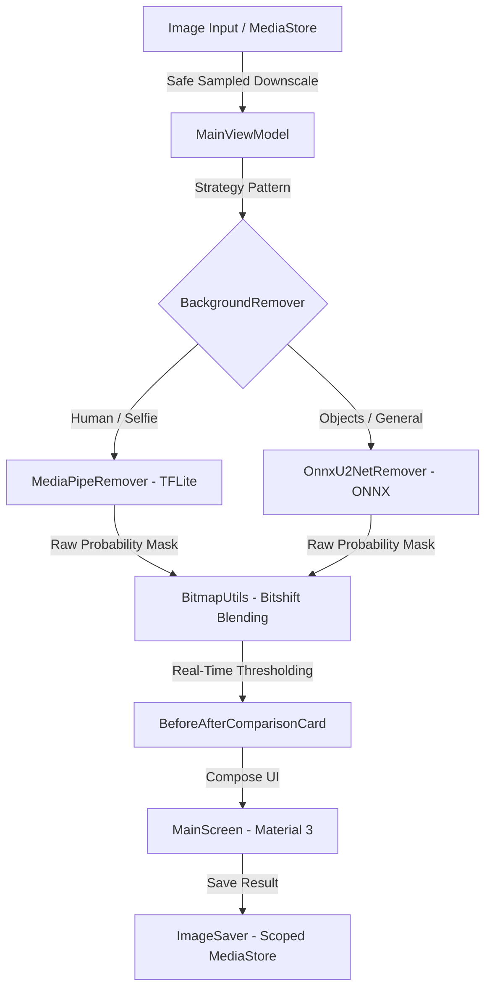

# 🖼️ RMBG - 100% Offline AI Background Remover

[](https://github.com/fatuhsa/rmbg/actions/workflows/ci.yml)
[](https://kotlinlang.org)
[](https://developer.android.com/jetpack/compose)
[-success.svg)](#privacy--security)
[](LICENSE)

**RMBG** is a high-performance, completely offline Android application for intelligent on-device background removal. Built with modern **Jetpack Compose + Material 3**, it delivers instant segmentation without sending a single byte to the cloud.

---

## ✨ Key Features

- 🔒 **100% On-Device & Private**: Zero network permissions (`android.permission.INTERNET` removed). Your photos never leave your device.
- ⚡ **Dual Offline AI Engines**:
  - **Fast Portrait (Google MediaPipe Tasks Vision)**: Ultra-fast (~50ms) selfie and human segmentation.
  - **General Objects (ONNX Runtime U2NetP)**: High-accuracy general object, product, and pet segmentation.
- 🎚️ **Interactive Before & After Split Slider**: Smoothly slide the divider left and right to inspect edge details against a transparency checkerboard.
- 🎛️ **Real-Time Sensitivity Tuning (10% – 90%)**: Adjust removal aggressiveness with instant feedback (< 5ms) without re-running the neural network.
- 💾 **MediaStore Scoped Storage Export**: Clean PNG export with transparency saved directly to `Pictures/RMBG`.
- 🚀 **Extreme APK Optimization**: R8 minification, native ABI filtering (`arm64-v8a`, `armeabi-v7a`, `x86_64`), thread-safe lazy engine caching, and zero-allocation bitshift pixel blending.

---

## 🏗️ Architecture & Tech Stack



- **UI Framework**: Jetpack Compose (BOM `2024.02.01`) + Material 3
- **State Management**: Kotlin Coroutines + `StateFlow` + Android `ViewModel`
- **Inference Engines**:
  - `com.google.mediapipe:tasks-vision:0.10.14`
  - `com.microsoft.onnxruntime:onnxruntime-android:1.17.1`
- **Design Palette**: Electric Indigo (`#3D5AFE`), Cool Slate (`#546E7A`), and Deep Teal (`#00796B`)

---

## 🚀 Getting Started

### Prerequisites
- Android Studio Iguana (2023.2.1) or newer
- JDK 17
- Android SDK (API Level 34)

### Building from Source

1. **Clone the repository:**
   ```bash
   git clone https://github.com/fatuhsa/rmbg.git
   cd rmbg
   ```

2. **Run Unit Tests:**
   ```bash
   ./gradlew testDebugUnitTest
   ```

3. **Build Debug APK:**
   ```bash
   ./gradlew assembleDebug
   ```
   *Output located at `app/build/outputs/apk/debug/app-debug.apk`*

4. **Build Signed Release APK:**
   ```bash
   ./gradlew assembleRelease
   ```
   *Output located at `app/build/outputs/apk/release/app-release.apk`*

---

## 🔒 Privacy & Security

RMBG requires **zero dangerous permissions**. It does not request internet access, location, or contact data. Photos selected via the system photo picker are processed strictly in RAM and stored locally upon user request.

---

## 🤝 Contributing

Contributions, issues, and feature requests are welcome! See [CONTRIBUTING.md](CONTRIBUTING.md) for full guidelines on setting up your environment and submitting pull requests.

---

## 📄 License

Distributed under the Apache 2.0 License. See `LICENSE` for more information.
